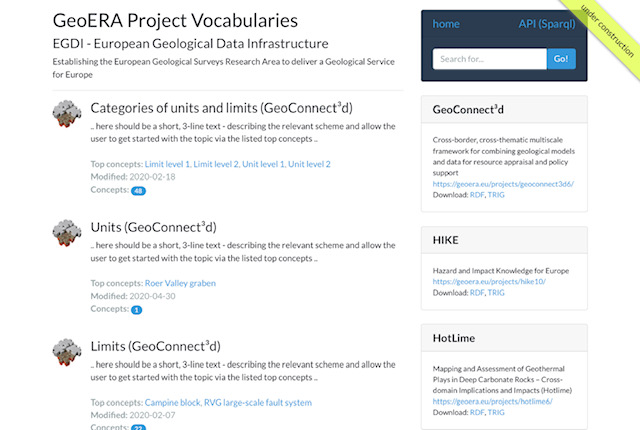
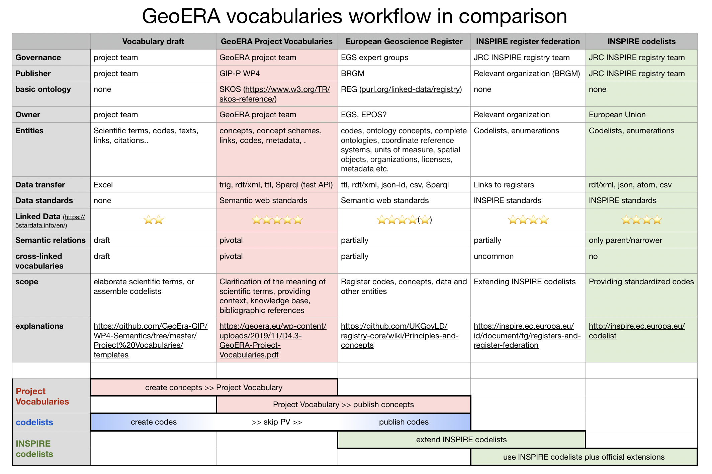

# GeoERA Project Vocabularies
Project vocabularies provide the opportunity to clarify expert knowledge and terminology in the form of project specific vocabulary concepts on a scientific level and to use them in datasets to code data. At the same time, parts of this vocabulary might be later included in international standards (e.g. INSPIRE or GeoSciML), if desired. By comparison, Project vocabularies are open collections of knowledge that, for example, may also contain deprecated, historical or only regionally relevant terms. In an ideal overall view, the sum of all Project vocabularies results in a knowledge database of bibliographically referenced terms that have been developed through scientific projects. Due to the consistent application of the data standards of Semantic Web and Linked Data nothing stands in the way of further use by modern technologies such as AI. The report explains what is meant by Project vocabularies in the context of GeoERA and examples of what problems, in semantics of data, can be solved by using them. In addition, project related methods and workflows around Linked Data, and SKOS in particular, are described.

  
* Use a **[template](https://github.com/GeoEra-GIP/WP4-Semantics/raw/master/Project%20Vocabularies/templates/PV_template_v3.zip)** to create Project Vocabularies  
* A provisional application for **testing Project Vocabularies** can be found **[here](https://schmar00.github.io/project-vocabularies/)**  
* For testing database queries with **SparQl** you can use this **[endpoint](https://resource.geolba.ac.at/PoolParty/sparql/geoera)**  
* see also our **[report deliverable](https://geoera.eu/wp-content/uploads/2019/11/D4.3-GeoERA-Project-Vocabularies.pdf)**
* if you need support **[mailto](mailto:martin.schiegl@geosphere.at)** me  

  
   
  
## Workflows and governance  

| Design steps | Results |
| --- | --- |
| create a **list** of all scientific **terms** (full extent) you want to integrate | To know what terms are concerned, plus total scope |
| Identify **synonyms**, **languages** and concepts which already exist | Total scope of concepts and concepts to be reused |
| Possibly define collections or sub sets of terms (**codelists**) | Affected codelists to create or extend, if any |
| Finalize **URI** domain, path and concept naming | URI design |
| **Definitions** for all scientific concepts, incl. bibliographic references or translations | Concepts at scientific level |
| Buildup **basic relations** (SKOS) suitable to use case (i.e. feature selection or keywords) | Semantics of concepts |
| Create Linked Data by mapping **other web resources** (i.e. INSPIRE codes) | Linked Data |
| Specify **custom relations**, classes, attributes defining final model (i.e. dcterms, foaf, CGI, etc.) | Knowledge base at project level |
| Define relations between **vocabularies** and other web resources, workflows, **governance**, maintenance  | Knowledge graph (more or less) |  

If your project plan is just to **extend INSPIRE codeLists** in an official way you can choose between 2 workflows:  
1. create a project vocabulary first to clarify semantic relations, definitions and bibliographic references. Therefore please use a **[template](https://github.com/GeoEra-GIP/WP4-Semantics/raw/master/Project%20Vocabularies/templates/PV_template_v3.zip)**. Then define the whole project vocabulary or parts of it to register for INSPIRE (federated registers). For modeling reasons and support it is important to know about intended codelist extensions from the beginning!  
or  
2. directly communicate to the "European Geoscience Registry" about intended extensions of codeLists and other standards. This workflow might have additional restrictions related to the kind of data which is intended to be registered.  
  
Following table shows the differences between the creation of codelists only (blue) versus GeoERA project vocabularies (red) in relation to official INSPIRE codelists or extensions.  
  
  
  
## links, examples
* a structural geological concept **[Mur-Mürz-Vienna Basin-Vah Large-scale Fault System](https://thesaurus.geolba.ac.at/?uri=http://resource.geolba.ac.at/structure/186&lang=en)**, composed of the individual faults parts and displayed on a **[web map](https://schmar00.github.io/gba-thesaurus/structureViewer.html?uri=http://resource.geolba.ac.at/structure/186&lang=en)**  

* a **[WMS map](http://www.ce-gic.org/wms/GBA_structures_2.html)** with clickable fault lines displaying mixed (WMS plus Linked Data) content in a pop up window  

