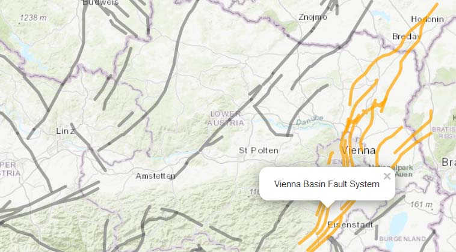

# GeoERA Project Vocabularies
Project vocabularies provide the opportunity to clarify expert knowledge and terminology in the form of project specific vocabulary concepts on a scientific level and to use them in datasets to code data. At the same time, parts of this vocabulary might be later included in international standards (e.g. INSPIRE or GeoSciML), if desired. By comparison, Project vocabularies are open collections of knowledge that, for example, may also contain deprecated, historical or only regionally relevant terms. In an ideal overall view, the sum of all Project vocabularies results in a knowledge database of bibliographically referenced terms that have been developed through scientific projects. Due to the consistent application of the data standards of Semantic Web and Linked Data nothing stands in the way of further use by modern technologies such as AI. The report explains what is meant by Project vocabularies in the context of GeoERA and examples of what problems, in semantics of data, can be solved by using them. In addition, project related methods and workflows around Linked Data, and SKOS in particular, are described.

A provisional application for **testing project vocabularies** can be found **[here](https://schmar00.github.io/project-vocabularies/)**  
For testing database queries with **SparQl** you can use this **[endpoint](https://resource.geolba.ac.at/PoolParty/sparql/geoconnect3d)**  
see also our **[report deliverable](https://geoera.eu/wp-content/uploads/2019/11/D4.3-GeoERA-Project-Vocabularies.pdf)**

## links, examples
* a structural geological concept **[Mur-Mürz-Vienna Basin-Vah Large-scale Fault System](https://thesaurus.geolba.ac.at/?uri=http://resource.geolba.ac.at/structure/186&lang=en)**, composed of the individual faults parts and displayed on a **[web map](https://thesaurus.geolba.ac.at/structureViewer.html?uri=http://resource.geolba.ac.at/structure/186&lang=en)**  

* a **[WMS map](http://www.ce-gic.org/wms/GBA_structures_2.html)** with clickable fault lines displaying mixed (WMS plus Linked Data) content in a pop up window

